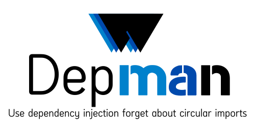

<p align="center">
  
</p>
<p align="center">
    <em>Dep man is a dependency manager library with dependency injection implementation and future annotations supporting for avoiding circular imports.</em>
</p>

<p align="center">

<a href="https://github.com/extralait-web/dep-man/actions?query=event%3Apush+branch%3Amaster+workflow%3ACI" target="_blank">
    
</a>
<a href="https://coverage-badge.samuelcolvin.workers.dev/redirect/extralait-web/dep-man" target="_blank">
    
</a>
<a href="https://pypi.python.org/pypi/dep-man-pydi" target="_blank">
    
</a>
<a href="https://pepy.tech/project/dep-man" target="_blank">
    
</a>
<a href="https://github.com/extralait-web/dep-man" target="_blank">
    
</a>
<a href="https://github.com/extralait-web/dep-man" target="_blank">
    
</a>

</p>

# Installation

Install using `pip install dep-man` or `uv add dep-man`

# Features

- [x] Annotation like providers injection
- [x] Future annotation support
- [x] Class instances injection
- [x] Sync and Async function result injection
- [x] Nested providers for inject in classes attrs and function args
- [x] Classes providers inheritance
- [x] ContextVar based injection
- [x] Scopes with grouped providers
- [x] Export providers in other scopes
- [x] Interfaces and protocol based injection from different scopes
- [x] Sync and Async context manager like injection
- [x] Nested context managers usage
- [x] Global context for avoiding context manager usage
- [x] Decoration like scopes injection for functions
- [x] Decoration like injection for classes
- [x] Middlewares for django and starlette
- [x] Multi DI managers supporting
- [x] Supported custom DI managers, scopes and injectors classes

# Examples

```py
# docs/examples/home/minimal/usage.py
```
